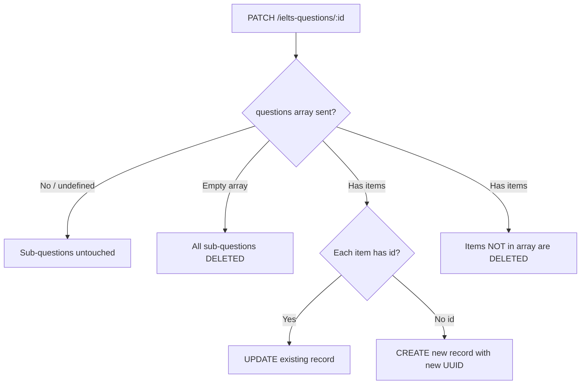

# IELTS Questions API — Frontend Guide

## Base URL

```
/ielts-questions
```

All endpoints require **Bearer token** authentication and **ADMIN** or **TEACHER** role (except GET endpoints which also allow **STUDENT** / **GUEST**).

---

## Endpoints

| Method | Path | Description |
|--------|------|-------------|
| `POST` | `/ielts-questions` | Create a question |
| `GET` | `/ielts-questions` | List questions (paginated) |
| `GET` | `/ielts-questions/:id` | Get single question |
| `PATCH` | `/ielts-questions/:id` | Update a question |
| `DELETE` | `/ielts-questions/:id` | Delete a question |

---

## Question Types

```
NOTE_COMPLETION | TRUE_FALSE_NOT_GIVEN | YES_NO_NOT_GIVEN
MATCHING_INFORMATION | MATCHING_HEADINGS | MATCHING_FEATURES
MATCHING_SENTENCE_ENDINGS | SUMMARY_COMPLETION
SUMMARY_COMPLETION_DRAG_DROP | MULTIPLE_CHOICE | MULTIPLE_ANSWER
SENTENCE_COMPLETION | SHORT_ANSWER | TABLE_COMPLETION
FLOW_CHART_COMPLETION | DIAGRAM_LABELLING | PLAN_MAP_LABELLING
```

---

## Query Parameters (GET list)

| Param | Type | Description |
|-------|------|-------------|
| `page` | number | Page number (default: 1) |
| `limit` | number | Items per page (default: 10, max: 100) |
| `search` | string | Search by title |
| `readingPartId` | UUID | Filter by reading part |
| `listeningPartId` | UUID | Filter by listening part |

---

## Create Question (POST)

```json
POST /ielts-questions
{
  "reading_part_id": "8a2370d1-...",
  "questionNumber": 1,
  "type": "MATCHING_HEADINGS",
  "instruction": "<p>Choose the correct heading...</p>",
  "headingOptions": {
    "i": "Heading text...",
    "ii": "Another heading..."
  },
  "points": 1,
  "isActive": true,
  "questions": [
    {
      "questionNumber": 1,
      "questionText": "Paragraph A",
      "correctAnswer": "iv",
      "explanation": "...",
      "fromPassage": "...",
      "order": 1
    }
  ],
  "options": []
}
```

---

## Update Question (PATCH)

> [!CAUTION]
> **To preserve sub-question and option IDs, you MUST include their `id` field in the request body.** If `id` is omitted, the backend deletes the old record and creates a new one with a **new UUID**.

### ✅ Correct — IDs are preserved

```json
PATCH /ielts-questions/1455eeba-9541-4ebc-b6cf-ddeecedeacb3
{
  "instruction": "<p>Updated instruction</p>",
  "questions": [
    {
      "id": "948b243d-1e89-4e13-8211-d3f072fc10f0",
      "questionNumber": 1,
      "questionText": "Paragraph A",
      "correctAnswer": "iv",
      "explanation": "Updated explanation",
      "order": 1
    },
    {
      "id": "c728fd12-14d6-4674-9584-4d86819b2656",
      "questionNumber": 2,
      "questionText": "Paragraph B",
      "correctAnswer": "viii",
      "order": 2
    }
  ]
}
```

### ❌ Wrong — IDs will change

```json
PATCH /ielts-questions/1455eeba-9541-4ebc-b6cf-ddeecedeacb3
{
  "questions": [
    {
      "questionNumber": 1,
      "questionText": "Paragraph A",
      "correctAnswer": "iv",
      "order": 1
    }
  ]
}
```

> Without `id`, ALL existing sub-questions are **deleted** and new ones are created.

---

## Update Behavior Summary



The same logic applies to `options[]`.

---

## Sub-Question Fields

| Field | Type | Required | Description |
|-------|------|----------|-------------|
| `id` | UUID | **Yes for update** | Existing sub-question ID |
| `questionNumber` | int | No | e.g. 1, 2, 3 |
| `questionText` | string | No | e.g. "Paragraph A" |
| `correctAnswer` | string | No | e.g. "iv", "TRUE" |
| `explanation` | string | No | Answer explanation |
| `fromPassage` | string | No | Referenced passage text |
| `points` | int | No | Points for this sub-question |
| `order` | int | No | Display order |

## Option Fields

| Field | Type | Required | Description |
|-------|------|----------|-------------|
| `id` | UUID | **Yes for update** | Existing option ID |
| `optionKey` | string | No | e.g. "A", "B", "C" |
| `optionText` | string | No | Option display text |
| `isCorrect` | boolean | No | Whether this is the correct option |
| `orderIndex` | int | No | Display order |
| `explanation` | string | No | Explanation |
| `fromPassage` | string | No | Referenced passage text |

---

## Frontend Implementation Pattern

```javascript
// When saving a question update, always map existing sub-questions with their IDs:
async function updateQuestion(questionId, formData) {
  const payload = {
    ...formData,
    // Always include the id from the original data
    questions: formData.questions.map(sq => ({
      id: sq.id,              // ← CRITICAL: include this!
      questionNumber: sq.questionNumber,
      questionText: sq.questionText,
      correctAnswer: sq.correctAnswer,
      explanation: sq.explanation,
      fromPassage: sq.fromPassage,
      order: sq.order,
    })),
    options: formData.options.map(opt => ({
      id: opt.id,             // ← CRITICAL: include this!
      optionKey: opt.optionKey,
      optionText: opt.optionText,
      isCorrect: opt.isCorrect,
      orderIndex: opt.orderIndex,
    })),
  };

  const res = await fetch(`/ielts-questions/${questionId}`, {
    method: 'PATCH',
    headers: {
      'Content-Type': 'application/json',
      'Authorization': `Bearer ${token}`,
    },
    body: JSON.stringify(payload),
  });

  return res.json();
}
```

---

## Common Scenarios

### Adding a new sub-question to an existing question
Send all existing sub-questions **with their IDs** + the new one **without an ID**:

```json
{
  "questions": [
    { "id": "existing-uuid-1", "questionText": "Paragraph A", "correctAnswer": "iv", "order": 1 },
    { "id": "existing-uuid-2", "questionText": "Paragraph B", "correctAnswer": "viii", "order": 2 },
    { "questionText": "Paragraph H", "correctAnswer": "v", "order": 8 }
  ]
}
```

### Removing a sub-question
Simply omit it from the array. Any existing sub-question whose ID is **not** in the request will be **deleted**:

```json
{
  "questions": [
    { "id": "existing-uuid-1", "questionText": "Paragraph A", "correctAnswer": "iv", "order": 1 }
  ]
}
```
> `existing-uuid-2` through `existing-uuid-7` would be deleted.

### Update only the parent question (don't touch sub-questions)
**Omit** the `questions` field entirely:

```json
{
  "instruction": "<p>New instruction text</p>",
  "points": 7
}
```
> Sub-questions and options remain unchanged.
